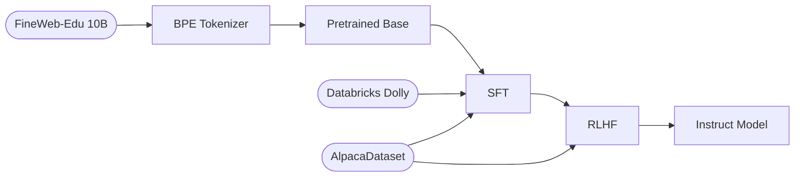
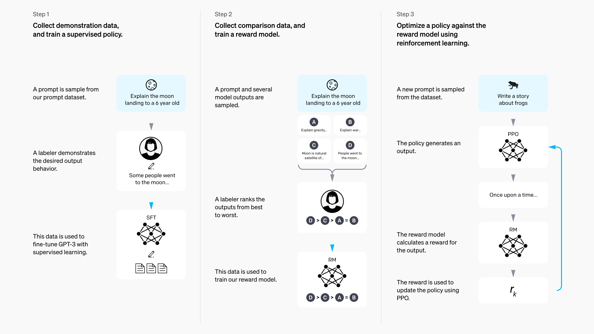

<div align="center">
  

# ChatGPT-2 (124M): from Pretraining to Instruct

A full LLM pipeline built from scratch: raw text → pretrained base → SFT → RLHF → instruct model.

  

</div>

This follows [Karpathy's](https://www.youtube.com/@AndrejKarpathy) nanoGPT/GPT-tokenizer series as a foundation, then extends it into a complete post-training pipeline: tokenizer, supervised fine-tuning on instruction data, and an RLHF stage with a reward model.

The goal was to understand every layer of the stack by building it, not importing it.

---

## Pipeline



---

## Pretraining

Architecture and data pipeline follow Karpathy's nanoGPT, trained on FineWeb-Edu 10B with GPT-3 paper hyperparameters. Supports single-GPU, multi-GPU (DDP), and Apple Silicon (MPS).

**Results after 1 epoch:**

| Metric | Value |
|---|---|
| HellaSwag | 0.3066 |
| Val loss | 3.0155 |
| Min train loss | 2.7657 |

**Extensions over the baseline:**

- Seasonality-aware data sampling to reduce distribution skew [`374e541`](https://github.com/jacoboromerodiaz/gpt-2/commit/374e541)
- Unwrapping the model before evaluation to allow `torch.compile` to eval HellaSwag cutting eval time [`0d4bfa7`](https://github.com/jacoboromerodiaz/gpt-2/commit/0d4bfa7)
- Checkpoint resume [`c555f96`](https://github.com/jacoboromerodiaz/gpt-2/commit/c555f96)

---

## Finetuning

Extends the pretrained base into an instruction-following assistant through two post-training stages, following the [InstructGPT](https://arxiv.org/abs/2203.02155) paradigm (Ouyang et al., 2022).

This implements Steps 1 and 3 of the InstructGPT pipeline. Step 2 (reward model training) is skipped by using OpenAssistant's pretrained DeBERTa-v3 reward model instead:

<div align="center">
  
</div>

Implementation details for both stages: [finetune/README.md](finetune/README.md)

### Stage 1: Supervised Finetuning

Fine-tuned on [`AlpacaDataset`](https://huggingface.co/datasets/yahma/alpaca-cleaned) and [`Databricks Dolly 15K`](https://huggingface.co/datasets/databricks/databricks-dolly-15k) to shift the model from next-token prediction on raw text to following the **assistant format**. Only assistant response tokens contribute to the loss, user prompts are masked with `-100` to prevent the model from memorizing queries.

### Stage 2: Reinforcement Learning from Human Feedback

Uses [Group Relative Policy Optimization](https://arxiv.org/abs/2402.03300) (DeepSeekMath, 2024) rather than vanilla PPO. The value network is dropped, advantages are computed from group-relative reward scores across `G=16` completions per prompt. A KL penalty against the frozen SFT reference prevents the policy from drifting too far.

**Results**

| Model | HellaSwag |
|---|---:|
| Pretrained | 0.3066 |
| SFT | 0.3080 |
| RLHF | **0.3174** |

Outputs and examples can be explored in [`finetune/playground.ipynb`](finetune/playground.ipynb).

---

## Tokenizer

Byte Pair Encoding implemented from scratch on the [`tokenizer`](https://github.com/jacoboromerodiaz/gpt-2/tree/tokenizer) branch, no libraries. Replicates the exact algorithm used in GPT-2: iterative pair merging over a UTF-8 byte vocabulary.

---

## Infrastructure

Used [Vast.ai](https://vast.ai) for all trainings.

#### Pretraining

Full pretraining for **~$7.50** (~37 h of training).

| Resource | Config |
|---|---|
| GPU | 1× 24 GB VRAM |
| Storage | 64 GB (FineWeb-Edu dataset + checkpoints) |
| Pricing | ~$0.201/h on-demand |
| Total cost | ~$7.50 |

Use **on-demand** (not interruptible) to avoid losing a mid-epoch checkpoint.

#### SFT

Supervised finetuning on another container of [Vast.ai](https://vast.ai) for **~$0.22** (<1 h of finetuning).

| Resource | Config |
|---|---|
| GPU | 1× 8 GB VRAM (pretrained checkpoint) |
| Storage | 16 GB (Datasets + checkpoints) |
| Pricing | ~$0.217/h on-demand |
| Total cost | ~$0.217 |

#### RLHF

Supervised finetuning on another container of [Vast.ai](https://vast.ai) for **~$2** (8 h of reinforcement learning).

| Resource | Config |
|---|---|
| GPU | 1× 24 GB VRAM (sft checkpoint + ref model + reward model) |
| Storage | 24 GB (Datasets + checkpoints) |
| Pricing | ~$0.217/h on-demand |
| Total cost | ~$1.74 |

---

### Option A — Docker template (recommended)

Select the **Docker** template on Vast.ai and point it to this repo's image: `jacoboromerodiaz/gpt-2:latest`. The container clones the repo, installs dependencies via `uv`, and downloads the pretrained checkpoint from Google Drive automatically.

Ready to pretrain/finetune/reinforce.

### Option B — PyTorch template

Select the **PyTorch** template, then run:

```bash
git clone https://github.com/jacoboromerodiaz/gpt-2.git
cd gpt-2

curl -LsSf https://astral.sh/uv/install.sh | sh
uv sync
source .venv/bin/activate

uv pip install gdown
gdown [PRETRAINED_CKPT_GOOGLE_DRIVE_ID] -O "/workspace/gpt-2/gpt2/log/model.pt"
gdown [SFT_CKPT_GOOGLE_DRIVE_ID] -O "/workspace/gpt-2/finetune/log/sft_model.pt"
```

> Replace `[GOOGLE_DRIVE_ID]` with your pretrained checkpoints. Model checkpoints can be provided upon request.

```bash
export SFT_CHECKPOINT="/workspace/gpt-2/gpt2/log/model.pt"
export GRPO_CHECKPOINT="/workspace/gpt-2/gpt2/log/sft_model.pt"
```
Then you are ready to pretrain/finetune/reinforce!